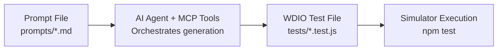

# Appium MCP Test Framework

A prompt-driven test framework that uses AI orchestration of Appium MCP tools to generate and verify WebdriverIO tests for mobile apps.

## How It Works



1. **Write a prompt** in `prompts/<scenario>.md` describing what to test
2. **AI agent** reads the prompt, uses MCP tools to automate steps on the simulator
3. **Test file** is generated in `tests/<scenario>.test.js`
4. **Run tests** with `npm test` to verify on the simulator

## Quick Start

### Install Dependencies

```bash
npm install
```

### Generate a Test from a Prompt

```bash
npm run generate prompts/reminders-app.md
```

This will:
1. Read and parse the prompt file
2. Display AI agent instructions for MCP tool execution
3. Generate a WDIO test file in `tests/`
4. (Optionally) Run the test on the simulator

### Run Generated Tests

```bash
# Run all tests
npm run verify

# Run a specific test
npm run verify tests/reminders-app.test.js

# Or use wdio directly
npm test -- --spec tests/reminders-app.test.js
```

### Clean Generated Files

```bash
npm run clean
```

## Project Structure

```
appium-mcp-playground/
├── prompts/                          # Prompt files (test scenarios)
│   ├── reminders-app.md              # Example: Reminders app test
│   ├── safari-app.md                 # Safari search test
│   ├── contact-app.md                # Contacts add contact test
│   ├── templates/
│   │   └── prompt-template.md        # Reusable prompt template
│   └── archive/                      # Completed prompts
├── tests/                            # Generated WDIO tests
│   ├── helpers/
│   │   └── base-test.js              # Shared test utilities
│   ├── reminders-app.test.js         # Generated test (example)
│   ├── safari-app.test.js            # Safari search test
│   └── contact-app.test.js           # Contacts add contact test
├── docs/                             # Project documentation
│   ├── roadmap.md                    # Development roadmap
│   └── notes.md                      # General notes
├── src/                              # Framework source
│   ├── cli.js                        # CLI entry point
│   ├── prompt-parser.js              # Prompt file parser
│   └── test-generator.js             # WDIO test code generator
├── test-results/                     # Debug artifacts (screenshots, page source)
├── wdio.conf.js                      # WebdriverIO configuration
├── package.json
└── README.md
```

## Prompt File Format

Prompts are markdown files with YAML frontmatter:

```markdown
---
title: Create Reminder
app: reminders
version: 1
---

# Create Reminder

Test creating a new reminder in the Reminders app.

## Steps:

1. Tap "New Reminder" button
2. Enter the title "Test reminder" in the title field
3. Tap "Done" to save
4. Verify the reminder appears in the list

## MCP Tools to use:

- appium_session_management (create session)
- appium_find_element (accessibility id)
- appium_gesture (tap)
- appium_set_value
- appium_generate_tests

## Notes:

Any additional context for the AI agent.
```

### Frontmatter Fields

| Field   | Required | Description                          |
|---------|----------|--------------------------------------|
| title   | Yes      | Scenario name (used for test title)  |
| app     | No       | App name (default: reminders)        |
| version | No       | Prompt version (default: 1)          |

### Steps Format

Numbered steps describing the automation sequence. The AI agent will:
- Map each step to appropriate MCP tool calls
- Generate corresponding WDIO test code

### MCP Tools Section

List the MCP tools the AI agent should use. Common tools:

| Tool                      | Purpose                              |
|---------------------------|--------------------------------------|
| `appium_session_management` | Create/manage Appium session       |
| `appium_find_element`       | Locate elements (accessibility id) |
| `appium_gesture`            | Tap, scroll, swipe actions         |
| `appium_set_value`          | Enter text into fields             |
| `appium_get_page_source`    | Read page content for verification |
| `appium_generate_tests`     | Generate WDIO test code            |

## CLI Commands

### `npm run generate <prompt> [--no-run]`

Generate a WDIO test from a prompt file.

```bash
npm run generate prompts/reminders-app.md
npm run generate prompts/reminders-app.md --no-run  # Generate without running
```

### `npm run verify [test-file]`

Run generated tests on the simulator.

```bash
npm run verify              # Run all tests
npm run verify tests/foo.test.js  # Run specific test
```

### `npm run clean`

Remove all generated test files.

```bash
npm run clean
```

## Generated Test Format

Generated tests are standalone WebdriverIO v9 tests using Mocha + Chai:

```javascript
/**
 * Generated from: prompts/reminders-app.md
 * Generated by: appium-mcp-playground CLI
 * MCP Tools: appium_session_management, appium_find_element, ...
 */
const { expect } = require('chai');

describe('Reminders - Create Reminder', function () {
  this.timeout(60000);

  it('should create a new reminder with title "Test reminder"', async function () {
    // Step 1: Get the initial reminder count from page source
    let pageSource = await browser.getPageSource();
    const initialCountMatch = pageSource.match(/All,\s*(\d+)\s*reminders/);
    const initialCount = initialCountMatch ? parseInt(initialCountMatch[1]) : 0;

    // Step 2: Tap "New Reminder" button.
    const newReminderBtn = await $('~New Reminder');
    await newReminderBtn.waitForDisplayed({ timeout: 10000 });
    await newReminderBtn.click();

    // Wait for the new reminder screen to appear
    await browser.pause(2000);

    // Step 3: Enter the title "Test reminder" in the title field.
    const titleField = await $('~Quick Entry Title Field');
    await titleField.waitForDisplayed({ timeout: 10000 });
    await titleField.setValue('Test reminder');

    // Wait for the text to be entered
    await browser.pause(1000);

    // Step 4: Tap "Done" to save the reminder.
    const doneBtn = await $('~Done');
    await doneBtn.waitForDisplayed({ timeout: 10000 });
    await doneBtn.click();

    // Wait for the reminder to be saved and home screen to appear
    await browser.pause(3000);

    // Step 5: Verify the reminder count increased
    pageSource = await browser.getPageSource();
    const finalCountMatch = pageSource.match(/All,\s*(\d+)\s*reminders/);
    const finalCount = finalCountMatch ? parseInt(finalCountMatch[1]) : 0;
    
    expect(finalCount).to.equal(initialCount + 1);
  });
});
```

## Writing Custom Tests

You can write tests manually alongside generated ones. Use the shared helpers:

```javascript
const { expect } = require('chai');
const { remindersLocators, tap, enterText } = require('./helpers/base-test');

describe('Custom Test', function () {
  this.timeout(60000);

  it('should work', async function () {
    await tap(remindersLocators.newReminder);
    await enterText(remindersLocators.quickEntryTitle, 'Custom test');
    await tap(remindersLocators.done);
  });
});
```

## Troubleshooting

### Test fails to connect to simulator

Ensure the iOS simulator is running and Appium is properly configured:

```bash
appium doctor
```

### Element not found

Check the accessibility labels in the app. Use `appium_get_page_source` via the AI agent to inspect the current screen.

### Prompt parsing error

Ensure the prompt file has valid YAML frontmatter between `---` delimiters.

## License

ISC
