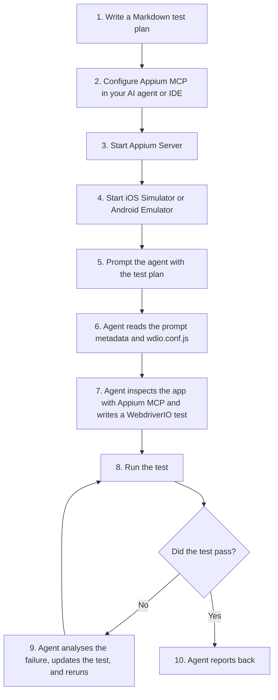

# ai-js-appium-mcp

A WebdriverIO project where an AI coding agent writes and runs mobile UI tests through [Appium MCP](https://github.com/appium/appium-mcp).

You describe a scenario in Markdown. The agent uses Appium MCP to inspect the running app, find stable locators, write a WebdriverIO test, run it, and fix it until it passes. There is no test generator, prompt parser or DSL in this repo: the Markdown prompt is the specification, and `AGENTS.md` tells the agent how to work.

`tests/create-contact.test.js` is an example of a test an agent wrote from `prompts/create-contact.md`.

## Workflow



Each prompt in `prompts/` defines the app, platform, bundle ID (iOS) or package name (Android), objective, entry point, steps, expected results and exit point. Start new ones from `prompts/templates/prompt-template.md`.

## Prerequisites

- Node.js 22+
- Appium Server with the XCUITest or UiAutomator2 driver
- [Appium MCP](https://github.com/appium/appium-mcp)
- Xcode and an iOS Simulator, or the Android SDK and an emulator
- An AI coding agent with MCP support, such as Claude Code, Cursor, OpenCode, Gemini CLI or Antigravity

## Appium MCP configuration

These configurations were tested. Replace the paths with your own.

**Antigravity**

```json
{
  "mcpServers": {
    "appium-mcp": {
      "command": "node",
      "args": [
        "-e",
        "console.log = console.error; console.info = console.error; console.debug = console.error; import('<path-to>/node_modules/appium-mcp/dist/index.js')"
      ],
      "env": {
        "ANDROID_HOME": "<path-to>/Android/sdk",
        "APPIUM_MCP_DOCS_ENABLED": "true"
      }
    }
  }
}
```

The `console.*` redirect keeps log output off stdout, which MCP uses for its protocol.

**OpenCode**

```json
{
  "mcp": {
    "appium-mcp": {
      "type": "local",
      "command": ["node", "<path-to>/node_modules/appium-mcp/dist/index.js"],
      "enabled": true,
      "timeout": 60000,
      "environment": {
        "ANDROID_HOME": "<path-to>/Android/sdk",
        "APPIUM_MCP_DOCS_ENABLED": "true"
      }
    }
  }
}
```

## Setup

```bash
npm install
cp .env.example .env
```

`.env` holds the defaults: Appium host and port, platform, device, and app. The agent normally supplies the app values (`APPIUM_PLATFORM`, `APPIUM_BUNDLE_ID`, `APPIUM_APP_PACKAGE`, `APPIUM_APP_ACTIVITY`) from the prompt when it runs a scenario.

## Running tests

```bash
npm run verify                                         # all tests
npm run verify -- tests/create-contact.test.js         # one test
APPIUM_BUNDLE_ID=com.apple.reminders npm run verify    # a different app
```

`npm run clean` deletes the generated tests and `test-results/`, and keeps `tests/helpers/`.

## Quality checks

`npm run lint` runs ESLint (`npm run lint:fix` to fix). A Husky pre-commit hook runs lint-staged on staged files. The rules that matter most for generated tests:

- `wdio/await-expect`: every assertion is awaited
- `wdio/no-debug` and `wdio/no-pause`: no `browser.debug()` or `browser.pause()`; use explicit waits
- `chai-friendly/no-unused-expressions`: assertions use `expect()`

## Structure

```text
├── AGENTS.md            # Workflow and rules for the AI agent
├── prompts/             # Markdown test plans
│   └── templates/       # Template for new prompts
├── tests/               # Agent-written WebdriverIO tests
│   └── helpers/
├── docs/
├── wdio.conf.js         # One generic config, driven by environment variables
└── eslint.config.js
```

## What this repo does and doesn't do

| Appium MCP | This repo |
|---|---|
| Creates and manages Appium sessions | Generic WebdriverIO configuration |
| Finds UI elements and suggests locators | Markdown scenarios and the agent workflow in `AGENTS.md` |
| Reads page source and takes screenshots | Stores and runs the agent-written tests |
| Interacts with the app | Lint rules for generated code |

Not included: a prompt parser, code generator or DSL, and management of the Appium server, simulators, emulators or devices.

## Known security alerts

Dependabot reports two high-severity alerts for `extract-zip` 2.0.1 ([GHSA-jmr9-qjv8-65gv](https://github.com/advisories/GHSA-jmr9-qjv8-65gv), [GHSA-7pqw-9j4j-h8q3](https://github.com/advisories/GHSA-7pqw-9j4j-h8q3)): a crafted zip file with symlink entries can write files outside the folder it's extracted to. No patched release of `extract-zip` exists.

It comes in through WebdriverIO (`@wdio/cli` → `@wdio/utils` → `@puppeteer/browsers`), which uses it to unpack browser and driver downloads. This project doesn't pass it any other archives. The alerts stay open until WebdriverIO or `@puppeteer/browsers` replaces or patches it; remove this note then.

## License

ISC
