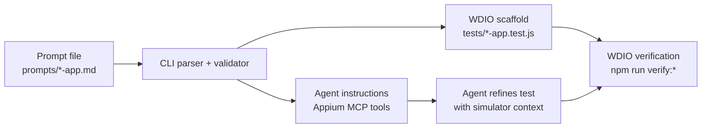

# Appium MCP Playground

This repository is a proof of concept for testing whether Appium MCP tools can help agents turn structured prompts into runnable WebdriverIO tests for iOS apps.

It is intentionally not a full E2E framework. The current CLI parses prompts, validates their structure, writes a conservative WDIO scaffold, and prints the MCP tool instructions an agent should use to complete or refine the test with live simulator context.

## Scope

This POC is meant to validate:

- whether prompt files provide enough structure for an agent to automate a simulator flow;
- whether MCP tool usage can be captured in generated WDIO tests;
- whether generated tests can be verified with app-specific WDIO configs.

This POC is not trying to provide:

- a general-purpose mobile automation framework;
- stable cross-device test infrastructure;
- comprehensive selector discovery;
- production-grade reporting, retries, or parallel execution.

## Workflow



1. Write a prompt in `prompts/<scenario>-app.md`.
2. Run the CLI to validate the prompt and generate a scaffold in `tests/<scenario>-app.test.js`.
3. Use the printed Appium MCP instructions to execute the flow on the simulator and refine selectors/assertions.
4. Run the generated test with the matching app config.

## Quick Start

```bash
npm install
```

Generate a scaffold without running the simulator:

```bash
npm run generate prompts/reminders-app.md -- --no-run
```

Run a generated Reminders test:

```bash
npm run verify:reminders -- tests/reminders-app.test.js
```

Run all generated tests with the Reminders config:

```bash
npm run verify
```

Run all app configs:

```bash
npm run verify:all
```

Run unit tests for the parser/generator:

```bash
npm run test:unit
```

## Simulator Setup

The WDIO configs default to local Appium on `127.0.0.1:4723`. Start Appium and boot an iOS simulator before verification.

Set these environment variables when the defaults do not match your machine:

```bash
export APPIUM_UDID="<simulator-udid>"
export APPIUM_PLATFORM_VERSION="<ios-version>"
```

The default UDID in the config files is only a local POC convenience. It is not expected to work on every machine.

## Project Structure

```text
appium-mcp-playground/
├── prompts/
│   ├── reminders-app.md
│   ├── safari-app.md
│   ├── contacts-app.md
│   └── templates/
│       └── prompt-template.md
├── tests/
│   ├── helpers/
│   │   └── base-test.js
│   └── unit/
│       ├── prompt-parser.test.js
│       └── test-generator.test.js
├── docs/
│   ├── notes.md
│   ├── roadmap.md
│   └── reviews/
│       └── framework-review.md
├── src/
│   ├── cli.js
│   ├── prompt-parser.js
│   └── test-generator.js
├── test-results/
├── wdio-reminders.conf.js
├── wdio-contacts.conf.js
├── wdio-safari.conf.js
├── package.json
└── README.md
```

Generated WDIO files live at `tests/*.test.js` and are ignored by git. The committed files under `tests/unit/` are unit tests for this POC's parser and generator.

## Prompt File Format

Prompts are markdown files with YAML frontmatter and required sections:

```markdown
---
title: Create Reminder
app: reminders
version: 1
---

# Create Reminder

Create a new reminder in the Reminders app and verify it appears in the list.

## Entry Point

- App: Reminders (bundleId: `com.apple.reminders`)
- Starting state: Reminders app is open on the main lists screen
- Device: iOS Simulator

## Steps:

1. Open the Reminders app on the iOS simulator
2. Tap "New Reminder" button
3. Enter the title "Test reminder" in the title field
4. Tap "Done" to save the reminder
5. Verify the reminder appears in the list

## MCP Tools to use:

- appium_session_management (create/manage sessions)
- appium_find_element (accessibility id strategy)
- appium_gesture (action=tap for button taps)
- appium_set_value (enter text into fields)
- appium_get_page_source (verify content)
- appium_generate_tests (generate WDIO test file)

## Exit Point

- Reminders returns to the list screen
- The newly created reminder title is visible or the reminder count increased
```

Required fields and sections:

| Item | Required | Purpose |
| --- | --- | --- |
| `title` | Yes | Scenario title used in the generated test |
| `app` | Yes | App config family, such as `reminders`, `contacts`, or `safari` |
| `version` | No | Prompt version for human tracking |
| `## Entry Point` | Yes | Starting app, screen, and simulator assumptions |
| `## Steps` | Yes | Numbered automation steps |
| `## MCP Tools to use` | Yes | Appium MCP tools the agent should use |
| `## Exit Point` | Yes | Success criteria and final state |

## CLI Commands

### Generate

```bash
npm run generate prompts/reminders-app.md
npm run generate prompts/reminders-app.md -- --no-run
npm run generate prompts/contacts-app.md -- --config wdio-contacts.conf.js
```

The generated filename is based on the prompt filename:

| Prompt | Generated file |
| --- | --- |
| `prompts/reminders-app.md` | `tests/reminders-app.test.js` |
| `prompts/contacts-app.md` | `tests/contacts-app.test.js` |
| `prompts/safari-app.md` | `tests/safari-app.test.js` |

### Verify

```bash
npm run verify
npm run verify -- tests/reminders-app.test.js
npm run verify:reminders -- tests/reminders-app.test.js
npm run verify:contacts -- tests/contacts-app.test.js
npm run verify:safari -- tests/safari-app.test.js
npm run verify:all
```

Use `--spec` only when invoking WDIO directly:

```bash
npm test -- --spec tests/reminders-app.test.js
```

### Clean Generated Files

```bash
npm run clean
```

This removes ignored generated files matching `tests/*.test.js`. It does not remove `tests/helpers/` or `tests/unit/`.

## Generated Test Scaffolds

Generated files are standalone WDIO Mocha tests using Chai. They include:

- a prompt reference header;
- normalized Appium MCP tool names;
- conservative comments for steps that need live MCP/simulator context;
- failure debug artifacts in `test-results/page-source.xml` and `test-results/debug.png` when possible.

The generator only emits direct selectors for clearly stated accessibility ids or quoted tap/verify targets. Ambiguous prose remains a `TODO(Appium MCP)` comment so an agent does not mistake guessed selectors for verified automation.

## Troubleshooting

### Prompt validation failed

Check that the prompt has `title`, `app`, `Entry Point`, numbered `Steps`, `MCP Tools to use`, and `Exit Point`.

### Test fails to connect to simulator

Confirm Appium is running and the simulator UDID/version match the WDIO config:

```bash
appium doctor
xcrun simctl list devices
```

### Element not found

Use `appium_get_page_source` through the MCP agent to inspect the current screen, then update the generated scaffold with verified accessibility ids.

## Review Tracker

Framework review findings and implementation status are tracked in `docs/reviews/framework-review.md`.

## License

ISC
