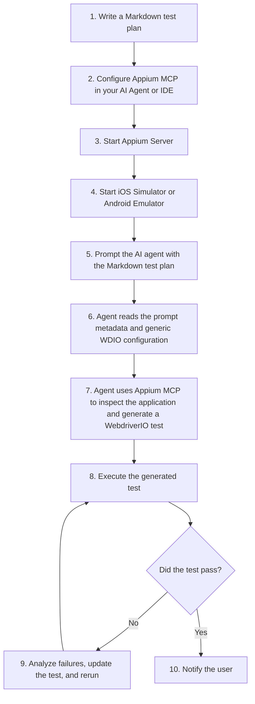

# Appium MCP Playground

A lightweight WebdriverIO project that enables AI coding agents to generate, execute, validate, and refine mobile UI tests using **Appium MCP**.

Unlike traditional automation frameworks, this project does **not** include a custom test generator, prompt parser, or framework-specific DSL. Instead, the AI agent uses Appium MCP to inspect the application, author WebdriverIO tests, execute them, diagnose failures, and iterate until the tests pass.

---

# Objective

Provide a minimal, AI-first WebdriverIO project that enables coding agents to generate, execute, validate, and refine mobile UI tests using Appium MCP.

---

# Source of Truth

The Markdown prompt is the source of truth for every automation scenario.

Each prompt defines:

- Application under test
- Platform
- Bundle ID (iOS) or Package Name (Android)
- Business objective
- Entry point
- Test steps
- Expected results
- Exit point

The AI agent reads this metadata, determines the execution context, uses Appium MCP to inspect the application, generates a WebdriverIO test, executes it, and iterates until the scenario passes.

---

# Expected Workflow



## Workflow

1. Write your test scenario as a Markdown document (for example `prompts/create-reminder.md`).
2. Configure Appium MCP in your preferred AI agent or IDE.
3. Start the Appium Server.
4. Launch the iOS Simulator or Android Emulator.
5. Prompt the AI agent using the Markdown test plan.
6. The AI agent reads the prompt metadata together with the generic `wdio.conf.js` configuration.
7. Using Appium MCP, the agent inspects the application, discovers stable locators, and generates a standalone WebdriverIO test.
8. WebdriverIO executes the generated test.
9. If execution fails, the AI agent diagnoses the failure, updates the generated test, and reruns it until all assertions pass.
10. Once successful, the AI agent notifies the user.

---

# Prerequisites

Before using this project, ensure the following are installed and configured:

- Node.js 22+
- WebdriverIO
- Appium Server
- Appium MCP
- Android SDK (Android testing)
- Xcode and iOS Simulator (iOS testing)
- An AI coding agent with MCP support (for example OpenCode, Antigravity IDE, Claude Code, Cursor, or Gemini CLI)

---

# Verified Appium MCP Configurations

## Antigravity IDE

```json
{
  "mcpServers": {
    "appium-mcp": {
      "command": "node",
      "args": [
        "-e",
        "console.log = console.error; console.info = console.error; console.debug = console.error; import('/Users/yash/.config/opencode/node_modules/appium-mcp/dist/index.js')"
      ],
      "env": {
        "ANDROID_HOME": "/Users/yash/Library/Android/sdk",
        "APPIUM_MCP_DOCS_ENABLED": "true"
      }
    }
  }
}
```

## OpenCode

```json
{
  "mcp": {
    "appium-mcp": {
      "type": "local",
      "command": [
        "node",
        "/Users/yash/.config/opencode/node_modules/appium-mcp/dist/index.js"
      ],
      "enabled": true,
      "timeout": 60000,
      "environment": {
        "ANDROID_HOME": "/Users/yash/Library/Android/sdk",
        "APPIUM_MCP_DOCS_ENABLED": "true"
      }
    }
  }
}
```

---

# Project Structure

```text
appium-mcp-playground/
│
├── prompts/
│   ├── create-contact.md
│   ├── create-reminder.md
│   ├── search-safari.md
│   └── prompt-template.md
│
├── tests/
│   ├── helpers/
│   └── *.test.js
│
├── test-results/
│
├── docs/
│
├── .env.example
├── .gitignore
├── AGENTS.md
├── package.json
├── README.md
└── wdio.conf.js
```

---

# Configuration

Copy the sample environment file.

```bash
cp .env.example .env
```

Update the values to match your local environment.

The values defined in `.env` act as defaults.

Application-specific values such as:

- `APPIUM_PLATFORM`
- `APPIUM_BUNDLE_ID`
- `APPIUM_APP_PACKAGE`
- `APPIUM_APP_ACTIVITY`

are typically derived by the AI agent from the Markdown prompt and supplied at runtime when executing a scenario.

---

# Running Tests

The project uses a single generic `wdio.conf.js` configuration.

## Run all generated tests

```bash
npm run verify
```

## Run a specific generated test

```bash
npm run verify -- tests/create-reminder.test.js
```

## Override the target application

### Reminders

```bash
APPIUM_BUNDLE_ID=com.apple.reminders npm run verify
```

### Contacts

```bash
APPIUM_BUNDLE_ID=com.apple.MobileAddressBook npm run verify
```

### Safari

```bash
APPIUM_BUNDLE_ID=com.apple.mobilesafari npm run verify
```

---

# Cleaning Generated Tests

Remove all generated tests while preserving helper utilities.

```bash
npm run clean
```

---

# Quality Gates

The project enforces code quality through ESLint and pre-commit hooks.

## Linting

Run ESLint across the project:

```bash
npm run lint
```

Auto-fix fixable issues:

```bash
npm run lint:fix
```

## Enforced Rules

- `wdio/await-expect` — All Chai assertions must be awaited
- `wdio/no-debug` — No `browser.debug()` in tests
- `wdio/no-pause` — No `browser.pause()` (use explicit waits instead)
- `chai-friendly/no-unused-expressions` — Chai assertions must use `expect()` style

## Pre-commit Hook

A Husky pre-commit hook runs lint-staged on every commit, auto-fixing ESLint issues on staged files. No need to manually lint before committing.

---

# Design Principles

This project intentionally remains lightweight.

## Included

- Markdown test scenarios
- Generic WebdriverIO configuration
- AI-generated WebdriverIO tests
- Debug artifacts
- AI-first workflow
- Appium MCP integration

## Included

- ESLint configuration with WDIO and Chai plugins
- Husky pre-commit hooks with lint-staged
- `.husky/pre-commit` — auto-lints staged files
- `eslint.config.js` — flat config with WDIO-specific rules

## Not Included

- Prompt parser
- Custom code generation engine
- Framework-specific DSL
- Appium Server management
- Simulator or Emulator management
- Device provisioning

The Markdown prompt is the specification.

The AI agent is responsible for interpreting it and generating the automation.

---

# Relationship with Appium MCP

This project complements Appium MCP rather than replacing it.

| Appium MCP | Playground |
|------------|------------|
| Creates and manages Appium sessions | Provides generic WebdriverIO configuration |
| Discovers UI elements | Stores AI-generated WebdriverIO tests |
| Generates reliable locators | Executes generated tests |
| Captures screenshots | Stores execution artifacts |
| Reads page source | Provides reusable Markdown scenarios |
| Interacts with the application | Defines the AI workflow through `AGENTS.md` |

Together they provide an AI-native workflow for mobile UI automation.

---

# License

ISC