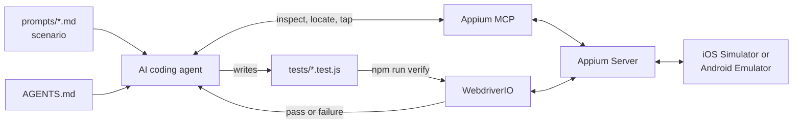

# ai-js-appium-mcp

An AI coding agent writes and runs WebdriverIO mobile UI tests for iOS and Android, using [Appium MCP](https://github.com/appium/appium-mcp) to inspect the running app.

[](https://github.com/yashwant-das/ai-js-appium-mcp/actions/workflows/lint.yml)
[](LICENSE)
[](https://webdriver.io)
[](https://github.com/appium/appium-mcp)
[](https://nodejs.org)

## Why it exists

Mobile UI tests are slow to write because finding stable locators means clicking through the app with an inspector. Here you describe a scenario in Markdown, and the agent does the inspecting through Appium MCP, writes the WebdriverIO test, runs it and fixes it until it passes. There is no generator, prompt parser or DSL: the Markdown prompt is the specification, and [AGENTS.md](AGENTS.md) tells the agent how to work.

[tests/create-contact.test.js](tests/create-contact.test.js) is a test an agent wrote from [prompts/create-contact.md](prompts/create-contact.md).

## Architecture


```mermaid
flowchart LR
    Prompt[prompts/*.md<br/>scenario] --> Agent[AI coding agent]
    Rules[AGENTS.md] --> Agent
    Agent <-->|inspect, locate, tap| MCP[Appium MCP]
    MCP <--> Appium[Appium Server]
    Appium <--> Device[iOS Simulator or<br/>Android Emulator]
    Agent -->|writes| Test[tests/*.test.js]
    Test -->|npm run verify| WDIO[WebdriverIO]
    WDIO <--> Appium
    WDIO -->|pass or failure| Agent
```

The agent explores the app through Appium MCP, writes a test, and runs it through WebdriverIO against the same Appium server; failures go back to the agent until the test passes.

## Quickstart

Prerequisites:

- Node.js 22+
- Appium Server with the XCUITest (iOS) or UiAutomator2 (Android) driver
- Xcode and an iOS Simulator, or the Android SDK and an emulator
- [Appium MCP](https://github.com/appium/appium-mcp), configured in an MCP-capable agent such as Claude Code, Cursor, OpenCode, Gemini CLI or Antigravity. Tested configurations are in [docs/appium-mcp-setup.md](docs/appium-mcp-setup.md).

```bash
git clone https://github.com/yashwant-das/ai-js-appium-mcp.git && cd ai-js-appium-mcp
npm install
cp .env.example .env      # Appium host/port, platform, device and default app
appium                    # in a second terminal, with a simulator or emulator running
npm run verify            # runs the example test
```

A passing run ends with the spec reporter listing the test as passed. To have the agent write a new test, give it a prompt from `prompts/` (start new ones from [prompts/templates/prompt-template.md](prompts/templates/prompt-template.md)). Each prompt names the app, platform, bundle ID or package, objective, steps, expected results and exit point; the agent passes those to `npm run verify` as environment variables.

```bash
npm run verify -- tests/create-contact.test.js         # one test
APPIUM_BUNDLE_ID=com.apple.reminders npm run verify    # a different app
npm run clean                                          # delete generated tests and test-results/
```

## Test reports and results

- CI runs ESLint on every push and pull request. The UI tests need a simulator or emulator, so they run locally, not in CI.
- WebdriverIO's spec reporter prints each run's results to the console.
- The lint rules that matter most for agent-written tests: `wdio/await-expect` (every assertion awaited), `wdio/no-debug` and `wdio/no-pause` (explicit waits only), and `chai-friendly/no-unused-expressions`. A Husky pre-commit hook runs them on staged files.

## Tech stack

| Layer | Tool | Version | Why |
| --- | --- | --- | --- |
| Test runner | WebdriverIO with Mocha | 9 | Standard Appium client for JavaScript |
| Device automation | Appium, XCUITest and UiAutomator2 | Appium Server | One API for iOS and Android |
| Agent tooling | Appium MCP | latest | Lets the agent read page source, find locators and drive the app |
| Assertions | Chai and WebdriverIO expect | 6, 9 | Readable assertions with built-in waits |
| Quality gates | ESLint with eslint-plugin-wdio, Husky, lint-staged | 10, 9, 17 | Catches unawaited assertions and hard waits in generated code |

## What this repo does and doesn't do

| Appium MCP | This repo |
|---|---|
| Creates and manages Appium sessions | Generic WebdriverIO configuration |
| Finds UI elements and suggests locators | Markdown scenarios and the agent workflow in `AGENTS.md` |
| Reads page source and takes screenshots | Stores and runs the agent-written tests |
| Interacts with the app | Lint rules for generated code |

Not included: a prompt parser, code generator or DSL, and management of the Appium server, simulators, emulators or devices.

## Project structure

```text
├── AGENTS.md            # Workflow and rules for the AI agent
├── prompts/             # Markdown test plans
│   └── templates/       # Template for new prompts
├── tests/               # Agent-written WebdriverIO tests
│   └── helpers/
├── docs/                # Appium MCP setup, notes and planned updates
├── wdio.conf.js         # One generic config, driven by environment variables
└── eslint.config.js
```

## Known security alerts

Dependabot reports two high-severity alerts for `extract-zip` 2.0.1 ([GHSA-jmr9-qjv8-65gv](https://github.com/advisories/GHSA-jmr9-qjv8-65gv), [GHSA-7pqw-9j4j-h8q3](https://github.com/advisories/GHSA-7pqw-9j4j-h8q3)): a crafted zip file with symlink entries can write files outside the folder it's extracted to. No patched release of `extract-zip` exists.

It comes in through WebdriverIO (`@wdio/cli` → `@wdio/utils` → `@puppeteer/browsers`), which uses it to unpack browser and driver downloads. This project doesn't pass it any other archives. The alerts stay open until WebdriverIO or `@puppeteer/browsers` replaces or patches it; remove this note then.

## Documentation

- [docs/appium-mcp-setup.md](docs/appium-mcp-setup.md): tested Appium MCP configurations
- [docs/future-updates.md](docs/future-updates.md): planned improvements
- [AGENTS.md](AGENTS.md): how the agent writes, runs and fixes tests

## License

MIT. See [LICENSE](LICENSE).
